# Qualitative results from inference

OFA is evaluated empirically with all OFA variants: tiny, medium, base, large, and huge on zero-shot inference for Image Classification and Visual Question Answering. Images are taken from the pretraining sample dataset and default generator params from the Huggingface repo:

```
generator = sequence_generator.SequenceGenerator(
                    tokenizer=tokenizer,
                    beam_size=3,
                    max_len_b=10, 
                    min_len=0,
                    no_repeat_ngram_size=3,
                    temperature=0.5,
                )
```

For Image Captioning we follow the instruction from the prompt-tuning enhancement for pretraining as highlighted in the ["Prompt Tuning for Generative Multimodal Pretrained Models" paper](https://arxiv.org/pdf/2208.02532) and we use as prompt the following: `[Image] What does the image describe?` and for VQA we are not constrained: `[Image] (Question)`: 

## Image Captioning

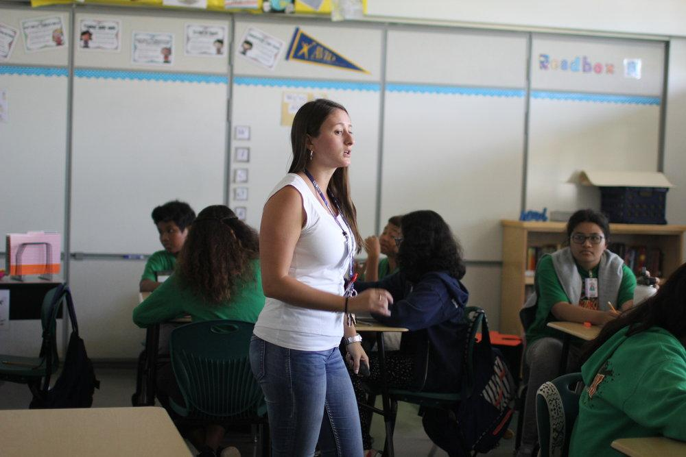

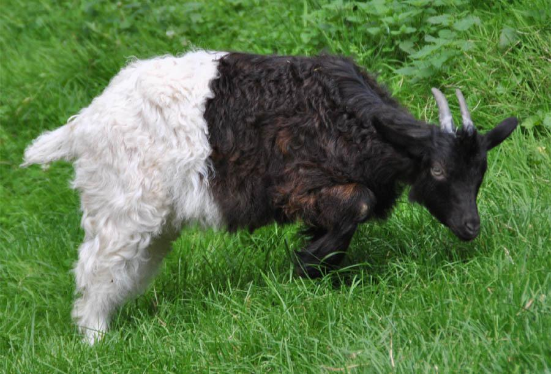

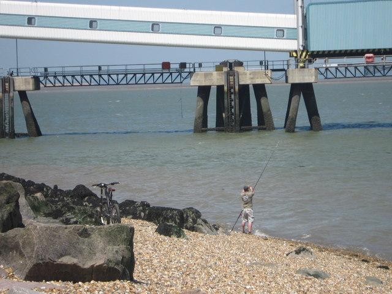

|  OFA   | Image 1 | Image 2 | Image 3 |
|--------|---------|---------|---------|
| Tiny   |   a woman wearing a white shirt and blue jeans      |    the dog is black and white     |    the water is calm     |
| Medium |   students in a classroom listening to a presentation      |   a goat in the grass      |    the bridge is now under water     |
| Base   |   a teacher stands in front of her class      |   a black and white goat grazes in a field      |   a man fishing on the rocks at the beach      |
| Large  |   person teaches a class of students      |    a black and white goat grazing on grass     |   a fisherman tries his luck on the beach        |
| Huge   |   students in a classroom with a teacher      |  a goat with a white spot on its back       |    a view of the sea wall at camber sands       |


with bigger temperature - `2.0`, return sequence max length - `20` and no. of beams - `4`:

```
gen = model.generate(inputs, patch_images=patch_img, num_beams=4, no_repeat_ngram_size=3,
                     temperature=2.0, max_length=20, min_length=0, num_return_sequences=1,
                     output_scores=True, output_attentions=True, output_hidden_states=True,
                     return_dict_in_generate=True, use_cache=False)
```


|  OFA   | Image 1 | Image 2 | Image 3 |
|--------|---------|---------|---------|
| Tiny   |   a woman wearing a white shirt and blue jeans      |   the dog is black and white      |   the water is calm      |
| Medium |   students in a classroom listening to a presentation      |   goat in the grass photo #      |   this is a picture of a man fishing from a pier in the water      |
| Base   |   a teacher stands in front of her class      |   a black and white goat grazes in a field       |   a man fishing on the rocks at the mouth of the yarra river       |
| Large  |   person teaches a class of students      |     a black and white baby goat eating grass     |    a fisherman tries his luck on the beach in front of the tappan zee bridge     |
| Huge   |   students in a classroom with a teacher      |  a goat with a white spot on its back       |    people fishing on the shingle beach at weston super mare, north somerset     |

HuggingFace also supports the OFA large variant fine-tuned for Image Captioning: 

| OFA Large Caption (finetune) | Image 1 Caption | Image 2 Caption | Image 3 Caption |
|-----------|----------------|----------------|----------------|
| alt generator | a woman standing in a classroom with a remote in her hand | a black and white goat standing on top of a lush green field | a man standing on a beach holding a fishing pole |
| default generator | a woman standing in a classroom with a remote | a black and white goat grazing in a field | a man standing on a beach holding a fishing pole |

## VQA

For VQA we evaluate qualitatively and empirically zero-shot transfer with examples from multiple benchmarks:` VQA v2, VizWiz, GQA, TextVQA, OK-VQA, A-OK-VQA and Visual Commonsense Reasoning with VCR`. We use the default question as coupeled for each image-text (question) pair:

### VQA v2

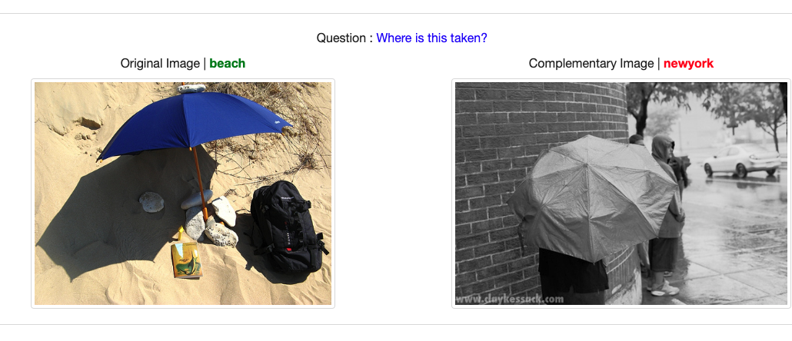

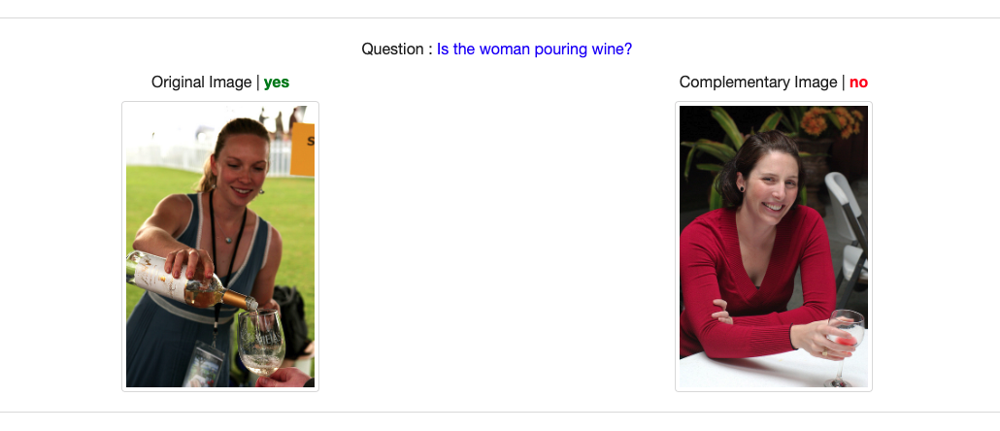

|  OFA   | Image 1  | Image 2  |
|--------|-----------------|-----------------|
| Question | **Where is the image on the left taken?** | **Is the woman on the left pouring wine?** | 
| Tiny   |   two umbrellas   |   response 2    |
| Medium |   no    |   response 4    |
| Base   |   in the rain   |   yes   |
| Large  |   a photo    |   response 8    |
| Huge   |   no    |   yes  |

### VizWiz


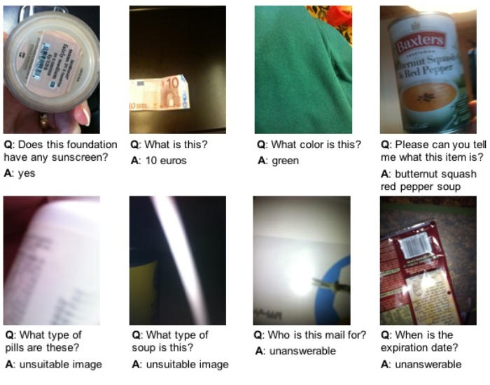

|  OFA   | Image 1  | Image 2  |
|--------|-----------------|-----------------|
| Question | **What currency is this?** | **Is the woman on the left pouring wine?** | 
| Base   |   euro   |   yes   |
| Large  |   dollar    |   response 8    |
| Huge   |   ten dollars    |   yes  |

### TextVQA

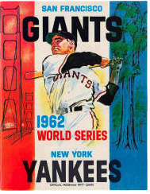

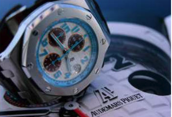

|  OFA   | Image 1  | Image 2  |
|--------|-----------------|-----------------|
| Question | **What city are the giants/yankees from?** | **What number is the small hand on?** | 
| Base   |   new york   |   12   |
| Large  |   new york   |   7    |
| Huge   |   new york    |   7  |


### GQA

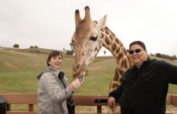

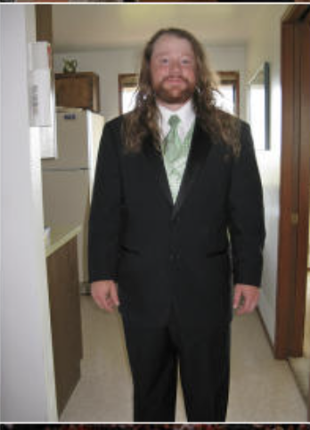

|  OFA   | Image 1  | Image 2  |
|--------|-----------------|-----------------|
| Question 1 | **Is that a giraffe or an elephant?** | **Is the person's hair brown and long?** | 
| Base   |   giraffe   |   yes   |
| Large  |   giraffe  |   yes   |
| Huge   |   giraffe    |   yes  |
| Question 2 | **Who is feeding the giraffe behind the man?** | **What appliance is to the left of the man?** | 
| Base   |  a drink  |   refrigerator   |
| Large  |   woman  |   refrigerator   |
| Huge   |   No    |   refrigerator  |
| Question 3 | **Is there any fence near the animal behind the man?** | **What is the person in front of the refrigerator wearing?** | 
| Base   |   Yes   |   suit   |
| Large  |   Yes  |   suit    |
| Huge   |   Yes    |   suit  |
| Question 4 | **Is there any fence near the animal behind the man?** | **What is hanging on the wall?** | 
| Base   |   Yes   |   paper   |
| Large  |   Yes  |   pictures      |
| Huge   |   Yes    |   a poster  |

## Knowledge VQA

### OK-VQA

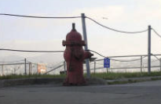

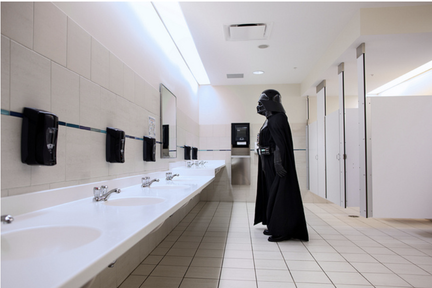

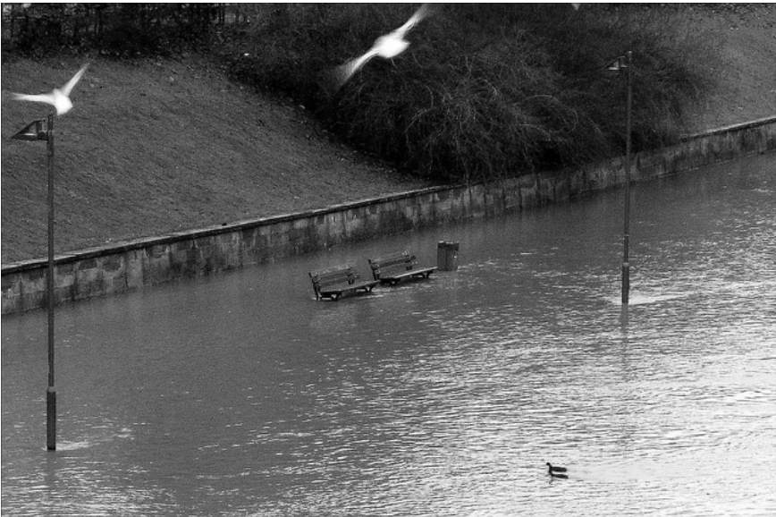

|  OFA   | Image 1  | Image 2  | Image 3 |
|--------|-----------------|-----------------|---------|
| Question | **What sort of vehicle uses this item?** | **What movie is this character from?** | **What is the name of the man who built the arc in the bible due to this natural catastrophe?** |
| Base   |   fire hydrant  |  batman   | no | 
| Large  |   fire truck   |   star wars   | jesus |
| Huge   |   fire truck   |   star wars  | jesus  | 

Image 3, Alt Question: What natural catastrophe is this?
Re: OFA large & huge: **flood**

## Visual Commonsense Reasoning

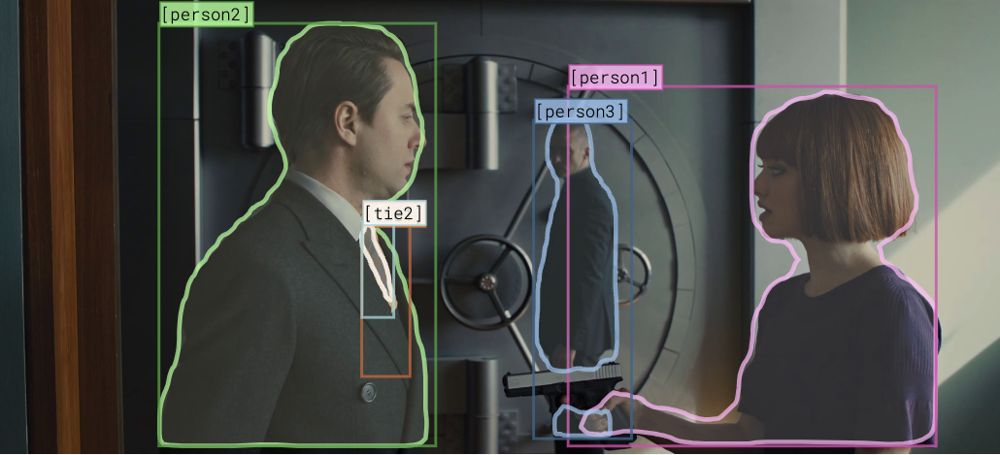

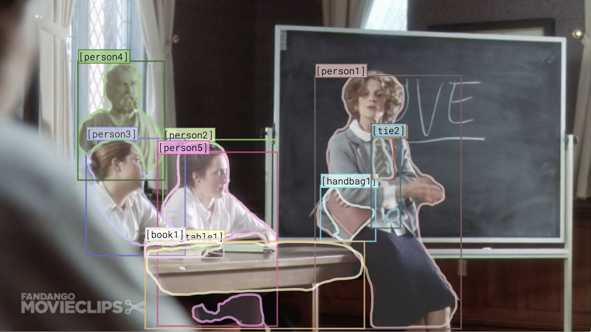

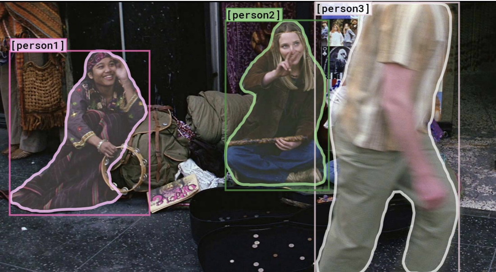

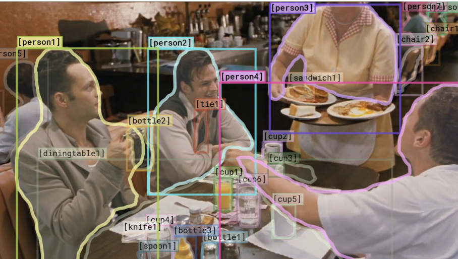

For VCR because the answers are more complicated than before, we need to set  the ` min_length` to a higher value - 10, otherwise we get only no/yes.

|  OFA   | Image 1  | Image 2  | Image 3 | Image 4 |
|--------|-----------------|-----------------|---------|-------|
| Question | **Why is [person1] pointing a gun at [person2]?**  | **What would [person1] do if she caught [person2] and [person3] whispering?** | **How did [person2] get the money that’s in front of her?** | **Why is [person4] pointing at [person1]?** | 
| Target | [person1] and [person3] are robbing the bank and [person2] is the bank manager | She would switch their seats | [person2] earned this money playing music | He is telling [person3] that [person1] ordered the pancakes|
| Base   |  [person1] pointing a gun at [person2]          |  blow her hair and then she will be able to hear it/blow her head with her mouth open and tongue out   | [person1] get the money that’s in front of her | [person4] pointing at [person4]  |
| Large  |  to kill the person in the first case of the series/to kill the person in charge of the gun    |  kiss the other woman's lips and mouth while talking to her/punch the man in the face with the stick    | postman [person2 ] got the money out of the box | to see the person eating the food in front of him/he is going to eat the food in front of him | 
| Huge   |  nobody's right hand is pointing at the person in the middle/not possible, because it is not possible to seeVnot possible, because it is not possible to see    |  do you know what she is saying to the other person/  | no indication of who it was, but it was a woman  | the right hand of the person in the middle of the picture | 

Image 2, Alt Question: What class is person1 teaching?
Re: OFA large & huge: english, OFA base: yes/i don't know what i am talking about